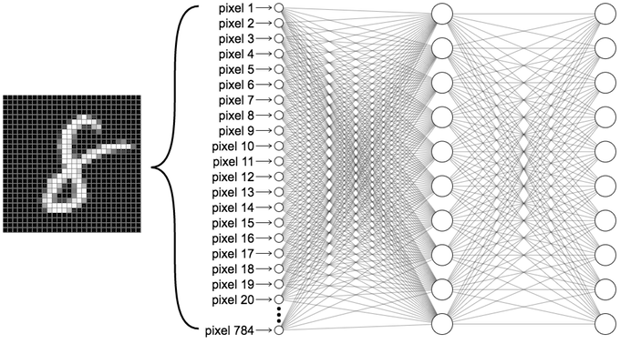
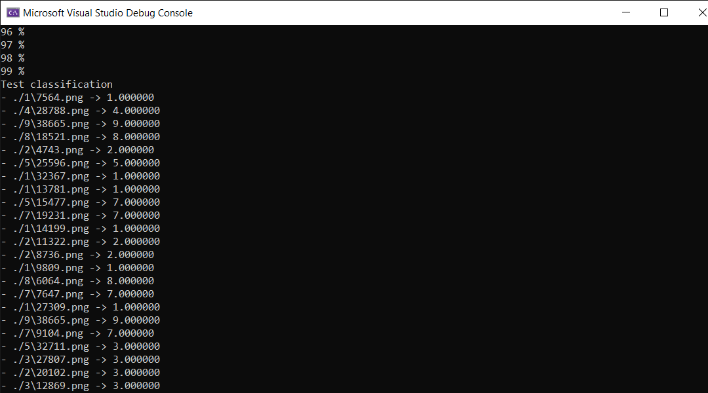
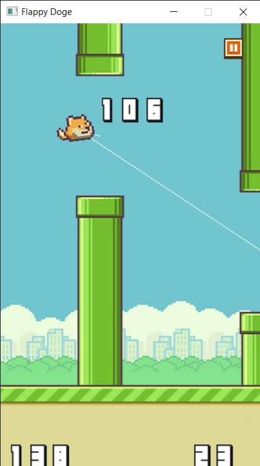

# neural-network-cpp
This project is the simple Artificial neural networks (ANN), which are computational systems that “learn” to perform tasks. This project is a library write in C++ language and it is easy to embed in another project.

## XOR
In this example tech the AI learns to compute XOR function.
Code example
``` C++
#include "pch.h"
#include "ANN.h"

int main()
{
	// input: 2
	// hidden: 4
	// output: 1
	int dim[3] = { 2,4,1 };

	// train data
	double input[] = {
		0,0,
		0,1,
		1,0,
		1,1
	};

	double output[] = {
		0,
		1,
		1,
		0
	};

	// init 3 layers
	ANN::CANN ann(dim, 3);

	ann.LearnExpected = [](double* trainData, int trainId, double* expectedOutput, int numOutput) {
		// XOR will return 0, 1
		expectedOutput[0] = trainData[trainId];
	};

	ann.Predict = [](const double* output, int numOutput)
	{
		// Convert output layer to XOR result
		if (output[0] >= 0.5)
			return 1;
		else
			return 0;
	};

	// train
	printf("Begin learning\n");
	for (int i = 0; i < 10000; i++)
	{
		ann.train(input, output, 4);
	}

	// test learning
	printf("Result\n");
	double* p = input;
	for (int i = 0; i < 4; i++)
	{
		double ret = ann.predict(p);
		printf("%d xor %d = %d\n", (int)p[0], (int)p[1], (int)ret);
		p += 2;
	}
	return 1;
}
```

## Digit Classification
For this example, the AI learns to recognize a small image file of 28x28 pixels.


The size image 28x28 = 784 inputs


```C++
// input: 784
// hidden: 32
// output: 10
int dim[] = { 784, 32, 10 };

// init 3 layers
ANN::CANN ann(dim, 3);

ann.LearnExpected = [](double* trainData, int trainId, double* expectedOutput, int numOutput)
{
	// ex: 3 => [0 0 0 1 0 0 0 0 0 0]
	int valueExpected = (int)trainData[trainId];
	for (int i = 0; i < 10; i++)
		expectedOutput[i] = (i == valueExpected) ? 1.0 : 0.0;
};

ann.Predict = [](const double* output, int numOutput)
{
	// ex: [0 0 0 1 0 0 0 0 0 0] => return 3
	double ret = 0;
	double max = output[0];
	for (int i = 0; i < 10; i++)
	{
		if (max < output[i])
		{
			max = output[i];
			ret = (double)i;
		}
	}
	return ret;
};
```

And the result test:


## Flappy Doge

For this example, the AI ​​will learn how to control the game Flappy Doge from human control.

Then they will improve themselves to play better.

And after about 20 generations, it can play good this game.

I try to use 2 layers with 6 neutrals

```C++
	ANN::CGeneticAlgorithm aiGenetic;
	const int dim[] = { 4, 6, 6, 1 };
	aiGenetic.createPopulation(MAX_AI_UNIT, dim, 4);
```




## References:
[Machine learning](https://zitaoshen.rbind.io/project/machine_learning/how-to-build-your-own-neural-net-from-the-scrach)
[ANN In C](https://github.com/gkrishnan724/ANN-IN-C)
[FlappyDoge project](https://github.com/Ducanger/Flappy-Doge-SDL2)
[Flappy Bird ML](https://github.com/ssusnic/Machine-Learning-Flappy-Bird)


